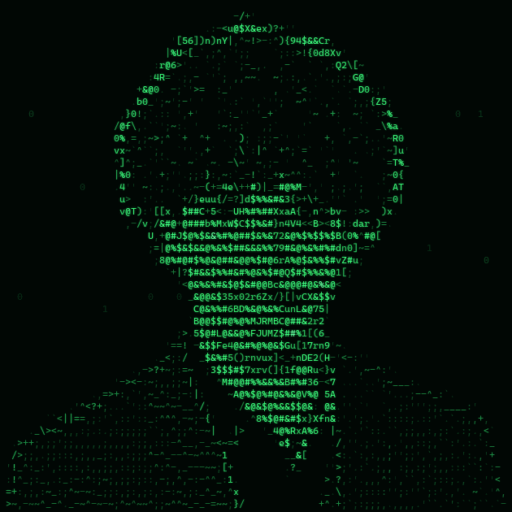

<!-- ░░░░░░░░░░░░░░░░░░░░░░░░░░░░░░░░░░░░░░░░░░░░░░░░░░░░░░░░░░░░░░░░░░░░░░ -->
<!--            proismamaster · Ismail Barakat · profile README         -->
<!-- ░░░░░░░░░░░░░░░░░░░░░░░░░░░░░░░░░░░░░░░░░░░░░░░░░░░░░░░░░░░░░░░░░░░░░░ -->

<div align="center">

<!-- Boot sequence animata (SVG nativo, nessuna dipendenza esterna) -->
<picture>
  <source media="(prefers-color-scheme: light)" srcset="assets/boot-light.svg" />
  <source media="(prefers-color-scheme: dark)"  srcset="assets/boot-dark.svg" />
  
</picture>

<br/><br/>

<!-- ASCII skull — bg si adatta al tema (nero in dark, bianco in light) -->
<picture>
  <source media="(prefers-color-scheme: light)" srcset="assets/skull-light.gif" />
  <source media="(prefers-color-scheme: dark)"  srcset="assets/skull-dark.gif" />
  
</picture>

<br/><br/>

<!-- Typing banner -->
<a href="https://ismailbarakat.dev">
  
</a>

<br/>


&nbsp;

&nbsp;


</div>

---

```console
ismail@brainos:~$ neofetch
```
```text
   ┌─────────────────────────────────────────────────────────────┐
   │ OS ...... BrainOS · Arch Linux (btw)                        │
   │ Host .... Politecnico di Milano — Ingegneria Informatica    │
   │ Kernel .. 6.7-cybersec-amd64                                │
   │ Uptime .. 18 years · still compiling                        │
   │ Shell ... bash · zsh · pwsh                                 │
   │ Roles ... Full-Stack · Mobile · IoT Developer               │
   │ Langs ... Python · C · Dart · JS/TS · PHP · Java            │
   │ Stack ... React19 · Vue · Node · Flutter · Docker · Linux   │
   │ Editor .. VS Code  (nvim on good days)                      │
   │ Focus ... Cybersecurity · AI/ML · Open Source · IoT         │
   │ Awards .. Hackergen finalist · OliCyber '26 · @BitCtrl '25  │
   │ Locale .. it_IT · ar · en_B2 · fr_A2                        │
   │ Status .. open to freelance & collabs                       │
   └─────────────────────────────────────────────────────────────┘
   > "Sperimentare molto, misurare tutto, tenere ciò che funziona."
```

<!-- palette bar stile neofetch -->
<p>
  
  
  
  
  
  
</p>

---

### `> ./stack --list`

<div align="center">

<sub>**languages**</sub><br/>


<sub>**frameworks · mobile · data**</sub><br/>


<sub>**iot · devops · tools**</sub><br/>


</div>

---

### `> ./projects --featured`

<table>
<tr>
<td width="50%" valign="top">

 [BaseFlow](https://github.com/proismamaster/BaseFlow) — [**▶ demo**](#-demo---project-baseflow)
> Editor di diagrammi di flusso che li esegue davvero e li traduce in codice.
> `Electron` · `Capacitor` · `open-source`

 [NutriApp](https://github.com/proismamaster/NutriApp-releases) — [**▶ demo**](#-demo---project-nutriapp)
> App nutrizione in Flutter: pasti, macro, grafici storici e report PDF.
> `Flutter` · `Android` · `v1.0.0`

</td>
<td width="50%" valign="top">

 [FlappyBird 2](https://github.com/proismamaster/FlappyBird-2) —  _Hackergen finalist_
> Riedizione del classico, premiata in hackathon.
> `game` · `web`

 [Raspberry Bluetooth Car](https://github.com/proismamaster/Rasberry-Car)
> Auto IoT comandata via Bluetooth.
> `Raspberry Pi` · `Bluetooth` · `IoT`

</td>
</tr>
</table>

<div align="center">
  <sub>↳ e altro su <a href="https://github.com/proismamaster?tab=repositories">github.com/proismamaster</a> · portfolio live su <a href="https://ismailbarakat.dev">ismailbarakat.dev</a></sub>
</div>

---

### `> ./demo --project baseflow`

<div align="center">

<video
  src="https://github.com/proismamaster/proismamaster/raw/main/assets/demo/baseflow-demo.mp4"
  poster="https://github.com/proismamaster/proismamaster/raw/main/assets/demo/baseflow-demo-poster.jpg"
  width="820" controls muted loop>
</video>

<sub>Se il player non parte: <a href="https://github.com/proismamaster/proismamaster/raw/main/assets/demo/baseflow-demo.mp4">apri il video</a> · 88s, senza audio</sub>

</div>

**BaseFlow** è un editor di diagrammi di flusso che non si limita a disegnarli.
Costruisci il diagramma a blocchi — input/output, assegnazioni, `if`, cicli,
grafica tartaruga — e poi lo **esegui**: il nodo attivo si illumina, le variabili
si aggiornano in tempo reale e la tartaruga disegna quello che il tuo algoritmo
le dice di disegnare. Lo stesso diagramma si esporta in **Python, JavaScript, C,
C++ e Java**, o come PNG e PDF.

Gira su desktop (Windows, macOS, Linux), su Android e nel browser come PWA:
stesso codice, stessi file `.bflow`. Gli installer si costruiscono da soli su
GitHub Actions a ogni tag.

<div align="center">
  <sub>↳ codice su <a href="https://github.com/proismamaster/BaseFlow">github.com/proismamaster/BaseFlow</a> · sorgenti del video in <a href="tools/demo-video">tools/demo-video</a></sub>
</div>

---

### `> ./demo --project nutriapp`

<div align="center">

<video
  src="https://github.com/proismamaster/proismamaster/raw/main/assets/demo/nutriapp-demo.mp4"
  poster="https://github.com/proismamaster/proismamaster/raw/main/assets/demo/nutriapp-demo-poster.jpg"
  width="820" controls muted loop>
</video>

<sub>Se il player non parte: <a href="https://github.com/proismamaster/proismamaster/raw/main/assets/demo/nutriapp-demo.mp4">apri il video</a> · 58s, senza audio</sub>

</div>

**NutriApp** è un'app di nutrizione scritta in **Flutter**, nata come progetto di
squadra con me team lead di quattro persone. Il punto è che registrare un pasto
deve costare pochi tocchi: **cerchi l'alimento per nome** sul database CREA (o ne
scansioni il codice a barre), si apre la scheda **già compilata**, scegli il pasto
e la porzione, e i valori si ricalcolano sul peso. Sotto ai macro ci sono grassi
nel dettaglio, **vitamine e minerali**, aperti solo se ti servono.

Quello che cucini spesso diventa una **ricetta**: un insieme di ingredienti coi
suoi valori, da registrare in un tocco invece di rifare la somma ogni volta. E
tutto lo storico si legge come **grafici** giornalieri, settimanali, mensili e
annuali, esportabili in un **report PDF**. Gira su Android e Windows, backend PHP.

> Il video unisce due sorgenti: la prima metà è una **registrazione fatta su un
> telefono vero** (ricerca, scheda del prodotto con le foto di OpenFoodFacts,
> salvataggio), la seconda è girata sul backend PHP e sul database reali del
> progetto. Il diario mostrato è costruito per la demo, non sono consumi reali.

<div align="center">
  <sub>↳ codice su <a href="https://github.com/proismamaster/NutriApp">github.com/proismamaster/NutriApp</a> · installer su <a href="https://github.com/proismamaster/NutriApp-releases/releases">NutriApp-releases</a></sub>
</div>

---

### `> ./demo --project mikesullyshop`

<div align="center">

<video
  src="https://github.com/proismamaster/proismamaster/raw/main/assets/demo/mikesullyshop-demo.mp4"
  poster="https://github.com/proismamaster/proismamaster/raw/main/assets/demo/mikesullyshop-demo-poster.jpg"
  width="820" controls muted loop>
</video>

<sub>Se il player non parte: <a href="https://github.com/proismamaster/proismamaster/raw/main/assets/demo/mikesullyshop-demo.mp4">apri il video</a> · 83s, senza audio</sub>

</div>

**MikeSullyShop** è un e-commerce completo scritto in **PHP senza framework** su
**MySQL**, a tema Monsters & Co. Il giro è quello vero di un negozio: catalogo con
ricerca e filtri, scheda prodotto col carosello delle immagini, e un **carrello che
riserva la merce per trenta minuti** — scaduto il tempo la giacenza torna
disponibile da sola. Al checkout i dati arrivano già compilati dall'account, si
sceglie fra tre metodi di pagamento, e con la carta parte un **OTP di quattro
cifre** da confermare prima che l'ordine venga registrato.

Dietro c'è un **pannello di gestione** protetto dal ruolo: magazzino con giacenze,
prezzi, sconti e caricamento multiplo delle foto; ordini da seguire e far avanzare
di stato; riepilogo delle vendite. Password con `password_hash`, query preparate,
`htmlspecialchars` ovunque.

> Il video sta soprattutto sul **pannello di gestione**, che è tre quarti della
> parte da desktop. L'ordine che poi si vede in cima agli Ordini è **vero** —
> viene creato passando dal checkout e dall'OTP — ma il checkout stesso resta
> **fuori campo**: indirizzo di spedizione e metodo di pagamento sono dati
> personali e non hanno niente da fare in un video di portfolio. Il catalogo e
> le foto sono quelli del repo; lo **storico ordini** precedente è costruito per
> la demo, altrimenti Ordini e Vendite sarebbero schermate vuote.

<div align="center">
  <sub>↳ codice su <a href="https://github.com/proismamaster/mike-sully-shop">github.com/proismamaster/mike-sully-shop</a></sub>
</div>

---

### `> ./stats --render`

<div align="center">

<a href="https://github.com/proismamaster?tab=followers"></a>


<br/><br/>


</div>

---

### `> ./activity --graph`

<div align="center">


<br/><br/>

<!-- Snake dei contributi — si attiva dopo il primo run della GitHub Action -->
<picture>
  <source media="(prefers-color-scheme: dark)"  srcset="https://raw.githubusercontent.com/proismamaster/proismamaster/output/github-snake-dark.svg" />
  <source media="(prefers-color-scheme: light)" srcset="https://raw.githubusercontent.com/proismamaster/proismamaster/output/github-snake.svg" />
  
</picture>

</div>

---

### `> ./contact --connect`

<div align="center">

<a href="https://ismailbarakat.dev">
  <picture>
    <source media="(prefers-color-scheme: light)" srcset="https://img.shields.io/badge/Portfolio-ffffff?style=for-the-badge&logo=firefoxbrowser&logoColor=0d6e28" />
    <source media="(prefers-color-scheme: dark)"  srcset="https://img.shields.io/badge/Portfolio-0d1117?style=for-the-badge&logo=firefoxbrowser&logoColor=00ff41" />
    
  </picture>
</a>
<a href="https://www.linkedin.com/in/ismail-barakat-7240b63b7">
  <picture>
    <source media="(prefers-color-scheme: light)" srcset="https://img.shields.io/badge/LinkedIn-ffffff?style=for-the-badge&logo=linkedin&logoColor=0A66C2" />
    <source media="(prefers-color-scheme: dark)"  srcset="https://img.shields.io/badge/LinkedIn-0d1117?style=for-the-badge&logo=linkedin&logoColor=0A66C2" />
    
  </picture>
</a>
<a href="mailto:ismail@ismailbarakat.dev">
  <picture>
    <source media="(prefers-color-scheme: light)" srcset="https://img.shields.io/badge/Email-ffffff?style=for-the-badge&logo=gmail&logoColor=EA4335" />
    <source media="(prefers-color-scheme: dark)"  srcset="https://img.shields.io/badge/Email-0d1117?style=for-the-badge&logo=gmail&logoColor=EA4335" />
    
  </picture>
</a>

</div>

<br/>

<details>
<summary><code>sudo ./reveal --easter-egg</code></summary>

<br/>

```
        .-"""""-.
      .'  _   _  '.
     /   (o) (o)   \
    |     .---.     |      "Talk is cheap.
    |    / \_/ \    |       Show me the code."
     \   '.___.'   /
      '.         .'
        '-.....-'
   ismail@brainos:~$ _
```

_Made with `☕`, `🔒` e un po' di `caos`. — Ismail_

</details>

<br/>

<div align="center">
  
</div>
